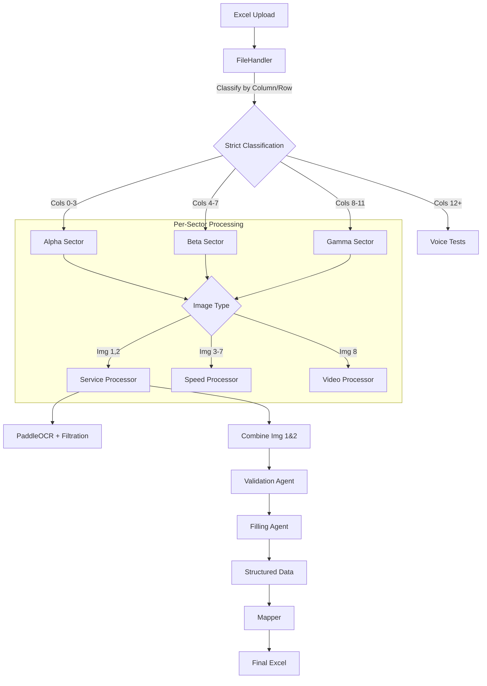

# 🔬 Cellular Template Processor (tempdod1)

A Streamlit-based application for extracting and analyzing cellular network data from Excel templates using **PaddleOCR** and **DeepSeek Reasoner**.

## 📋 Overview

This application processes Excel files containing cellular network test screenshots (Service, Speed, Video, Voice) and extracts structured data. It uses a strict pipeline to ensure data integrity and separation of concerns.

- **PaddleOCR**: Extracts raw text from images (No vision model required).
- **AI Agents**: Specialized agents for filtration, validation, and schema filling.
- **Strict Separation**: Images are physically classified by type before processing to prevent data mixing.

## 🏗️ Architecture

### Pipeline Flow



### Project Structure (Refactored)

```
tempdod1/
├── app.py                  # Streamlit entry point
├── core/
│   ├── pipeline.py         # Main orchestrator
│   ├── file_handler.py     # Strict image classification
│   ├── api_manager.py      # PaddleOCR & LLM client
│   ├── constants.py        # ALL fixed parameters & ranges
│   ├── config.py           # Pydantic Schemas
│   ├── mapper.py           # Excel mapping (Red+Bold)
│   ├── agents/             # AI Logic
│   │   ├── filtration.py   # OCR cleaning
│   │   ├── validation.py   # Telecom expert rules
│   │   └── filling.py      # Schema enforcement
│   └── processors/         # Per-type pipelines
│       ├── service.py
│       ├── speed.py
│       ├── video.py
│       └── voice.py
└── requirements.txt
```

## 🚀 Getting Started

### Prerequisites

- Python 3.8+
- NVIDIA API Key (for PaddleOCR and DeepSeek)

### Installation

1. **Clone the repository**
   ```bash
   git clone <repo-url>
   cd tempdod1
   ```

2. **Install dependencies**
   ```bash
   pip install -r requirements.txt
   ```

3. **Run the application**
   ```bash
   streamlit run app.py
   ```

## 📊 Features

### 1. Strict Data Separation
- **Service Data** (5G/LTE parameters) is processed *only* from images 1 & 2.
- **Speed Tests** are processed *only* from images 3-7.
- **Video Tests** are processed *only* from image 8.
- **Voice Tests** are processed *only* from the Voice column.

### 2. Intelligent Validation
The **Validation Agent** acts as a telecom expert:
- **Auto-Correction**: Fixes OCR errors like `1o4` → `104` or `3B4` → `384`.
- **Range Enforcement**: Ensures values (e.g., RSRP, SNR) fall within physics-compliant ranges.
- **No Nulls**: Guesses the closest valid value instead of failing.

### 3. Cost-Efficient
- Removed expensive Vision Models.
- Uses lightweight PaddleOCR + Text Reasoning.

## 📝 Configuration

All parameters, ranges, and allowed values are defined in `core/constants.py`.
- **Service Params**: ARFCN, Band, PCI, RSRP, RSRQ, SINR, etc.
- **Speed Params**: Download, Upload, Ping, Jitter.
- **Video Params**: Resolution, Load Time, Buffering.

## 👤 Author

**Anshul0946**
