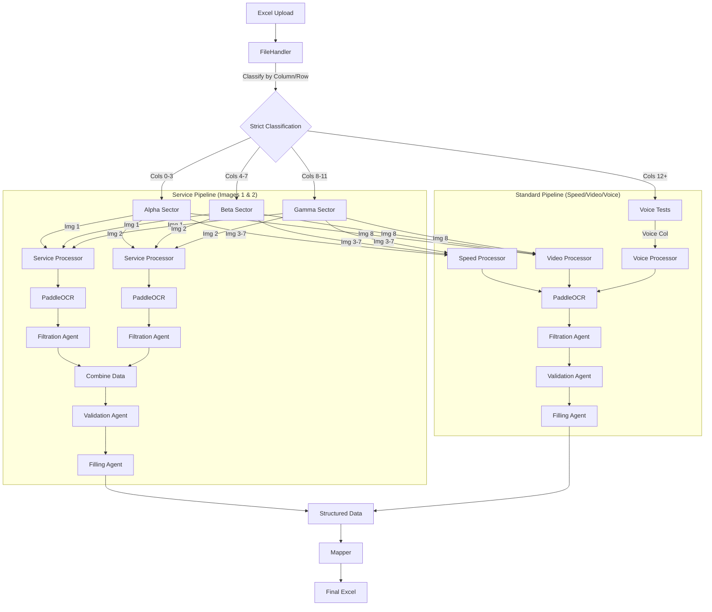

# 🔬 Cellular Template Processor (tempdod1)

A Streamlit-based application for extracting and analyzing cellular network data from Excel templates using **PaddleOCR** and **DeepSeek Reasoner**.

## 📋 Overview

This application processes Excel files containing cellular network test screenshots (Service, Speed, Video, Voice) and extracts structured data. It validates every data point against strict telecom standards before mapping it back to the Excel file.

## 🏗️ Architecture

### Processing Pipelines

The system uses two distinct pipeline flows depending on the image type:



### Project Structure

```
tempdod1/
├── app.py                  # Main Streamlit application
├── requirements.txt        # Python dependencies
└── core/
    ├── pipeline.py         # Orchestrator that routes images to processors
    ├── file_handler.py     # Classifies images by Excel Column & Index
    ├── api_manager.py      # Client for NVIDIA API (PaddleOCR + DeepSeek)
    ├── constants.py        # SOURCE OF TRUTH: Ranges, Units, Parameters
    ├── config.py           # Pydantic Schemas for Type Safety
    ├── mapper.py           # Maps valid data to "Bold Red" Excel cells
    │
    ├── agents/             # The "Brain" of the operation
    │   ├── filtration.py   # Cleans raw OCR noise
    │   ├── validation.py   # Telecom Expert (Fixes typos, checks ranges)
    │   └── filling.py      # Enforces Schema format
    │
    └── processors/         # Specialized Workflows
        ├── service.py      # Orchestrates the "Combine" logic for Img 1&2
        ├── speed.py        # Independent processing for Speed tests
        ├── video.py        # Independent processing for Video tests
        └── voice.py        # Independent processing for Voice calls
```

## 🚀 Getting Started

### Prerequisites

- Python 3.8+
- NVIDIA API Key (credits required for OCR and Reasoning)

### Installation

1. **Clone the repository**
   ```bash
   git clone <your-repo-url>
   cd tempdod1
   ```

2. **Install dependencies**
   ```bash
   pip install -r requirements.txt
   ```

3. **Run the application**
   ```bash
   streamlit run app.py
   ```

## 📊 distinct Features

### 1. Strict Data Separation
- **Service Data**: 5G/LTE parameters. Processed *strictly* from images 1 & 2 of Alpha/Beta/Gamma columns.
- **Speed Tests**: Download/Upload/Ping. Processed *strictly* from images 3-7.
- **Video Tests**: Resolution/Buffering. Processed *strictly* from image 8.
- **Voice Tests**: Duration/Status. Processed *strictly* from the specific "Voice" columns.

### 2. The Validation Agent (Telecom Expert)
This is not just a data checker; it is an intelligent corrector.
- **OCR Correction**: Sees `1o4` -> knows it's an integer -> corrects to `104`.
- **Unit Aawareness**: Knows `3B4 Mbps` is likely `384 Mbps`.
- **Physics rules**: Knows `RSRP` must be negative (e.g. `-90`), so if OCR says `90`, it corrects to `-90`.
- **Safety**: It **never** removes a value. It always guesses the closest valid likelihood.

## 👤 Author

**Anshul0946**
